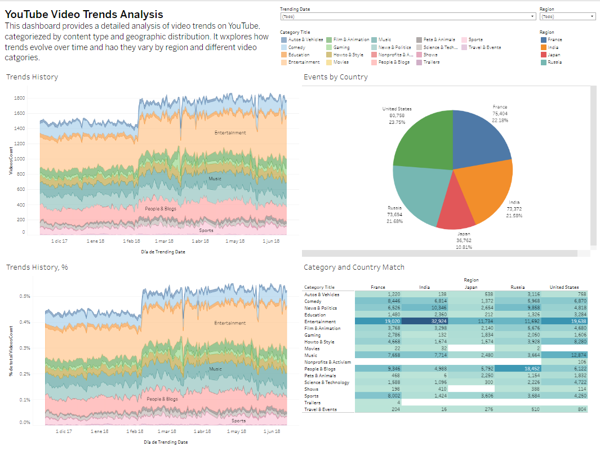

# Project: YouTube Video Trends Analysis Automation

## Project Description

This project aims to automate the process of analyzing YouTube video trends for the Sterling & Draper advertising agency. The focus is on identifying trending video categories across different regions, with a special emphasis on the United States.

## Workflow

### Part 1: Gathering Technical Requirements

- **Business Objective**: Analyze historical YouTube video trends to enhance advertising video planning.
- **Usage Frequency**: At least once daily.
- **Target Users**: Video planning managers.
- **Data Used**: Historical video trends data, categorized by day, category, and region.
- **Data Sources**: 
  - The `trending_by_time` table from the `youtube` database, updated every 24 hours.
  - Table Structure:
    - `record_id`: Primary key.
    - `region`: Country/geographic region.
    - `trending_date`: Date and time.
    - `category_title`: Video category.
    - `videos_count`: Number of videos in the trending section.

### Part 2: Dashboard Creation

1. **Dashboard Design**:
   - Created an interactive dashboard using `Tableau Public` based on the `trending_by_time.csv` table.
   - The dashboard allows filtering by date/time and region, affecting all visualizations.
   - Includes charts that show:
     - Historical trends in absolute numbers.
     - Historical trends in percentages.
     - A table showing the correspondence between categories and countries.

2. **Dashboard Publication**:
   - Published the dashboard on Tableau Public and verified its accessibility across different browsers.
   - [Access the Dashboard on Tableau Public](https://public.tableau.com/app/profile/barbara.ortiz/viz/DashboardYoutube_17249856041880/Dashboard?publish=yes)

3. **Analysis of Key Questions**:
   
   **What video categories were trending most frequently?**

   **Dominant Categories:**
   - **Comedy** and **Entertainment** are the categories that most frequently appear at the top of the graph. These categories consistently show a high percentage of trending videos throughout the analyzed period.
   - **Howto & Style** also has a notable presence, although its frequency and percentage are lower compared to Comedy and Entertainment.

   **Moderate Categories:**
   - **Music** and **News & Politics** show intermediate presence. These categories have spikes at certain times but do not maintain a high percentage consistently over time.
   - **People & Blogs** has a significant presence but is slightly less than the previously mentioned categories.

   **Minor Categories:**
   - **Sports** and **Others** (unspecified categories in the graph) have much lower presence compared to the other categories. These videos rarely reach a high percentage of trending.

   **Temporal Trends:**
   - The categories of Comedy and Entertainment experience pronounced peaks at certain moments, suggesting that specific events or releases may have driven these spikes.
   - Over the analyzed period, Comedy and Entertainment categories clearly dominated video trends, maintaining the highest percentages of trending videos consistently. Howto & Style also stood out, albeit less frequently. Music, News & Politics, and People & Blogs showed moderate presence, while Sports and other categories had minimal representation. In summary, comedy and general entertainment videos are the most popular and frequently trending.

   **How were they distributed across regions?**

   **Events by Country:**
   - 80,758 (23.75%) - United States
   - 75,404 (22.18%) - France
   - 73,694 (21.68%) - Russia
   - 36,762 (10.81%) - Japan
   - 73,372 (21.58%) - India

   **Distribution of Events:**
   - The pie chart shows the distribution of events by country, highlighting how these events are divided among different regions. Key observations include:
     - The United States has the highest number of events with 80,758, representing 23.75% of the total.
     - France follows closely with 75,404 events, constituting 22.18%.
     - Russia has 73,694 events, representing 21.68% of the total.
     - India accounts for 73,372 events, equivalent to 21.58%.
     - Japan has the smallest number among those shown, with 36,762 events, representing 10.81%.

   The distribution of events by country shows that the United States leads with 23.75% of the total, followed by France (22.18%), Russia (21.68%), and India (21.58%). Japan has the smallest share with 10.81%. Overall, events are fairly balanced among the major regions, although the United States has a slight edge.

   **Which categories were particularly popular in the United States? Were there differences between the popular categories in the U.S. and other places?**

   **Popularity of Categories in the United States:**
   - **Entertainment**: 19,638 events
   - **Music**: 12,874 events
   - **People & Blogs**: 6,122 events
   - **Comedy**: 6,870 events
   - **News & Politics**: 4,818 events

   **Comparison with Other Countries:**
   - **Entertainment**:
     - Also the most popular category in India (32,924 events), France (19,020 events), and is highly popular in Japan (11,734 events) and Russia (11,692 events).
   - **Music**:
     - Highly popular in the United States (12,874 events), but less so in France (7,658 events), India (7,714 events), Russia (3,664 events), and Japan (2,480 events).
   - **People & Blogs**:
     - Particularly popular in Russia (18,452 events) compared to other countries.
   - **Comedy**:
     - Shows a similar distribution in the U.S. (6,870 events), France (8,445 events), and India (6,814 events).
   - **News & Politics**:
     - More popular in India (10,346 events) and Russia (9,858 events) compared to the U.S. (4,818 events).

   In the United States, **Entertainment** and **Music** are particularly popular categories. While Entertainment is a leading category globally, Music has significantly higher popularity in the U.S. compared to other countries. People & Blogs is notably more popular in Russia, and News & Politics enjoys higher popularity in India and Russia compared to the U.S. Differences in category popularity reflect varying content preferences across regions.

   **Overall Analysis:**

   The video trend analysis and distribution of events by categories and countries have provided valuable insights into user preferences and behaviors across different regions. Throughout the analyzed period, Comedy and Entertainment categories have dominated video trends globally, reflecting a strong preference for humorous and general entertainment content.

   Geographically, the United States leads with the highest number of events, followed closely by France, Russia, and India, with Japan showing lesser representation. This balance suggests considerable and diverse interest in trending videos in these countries.

   Category popularity varies by region. In the U.S., Entertainment and Music are most prominent, while in Russia, People & Blogs is highly popular. India and Russia show notable preference for News & Politics, a category less prominent in the U.S. Understanding these differences is crucial for tailoring content and marketing strategies to local preferences, optimizing impact and relevance.

   In summary, the study provides a comprehensive view of how video trends and preferences vary by region, highlighting both global similarities and local differences in content consumption on video platforms.

## Dashboard Screenshot

Here is a preview of the dashboard:

---

This project automates trend analysis, enabling planning managers to make data-driven decisions based on up-to-date and well-organized information.
